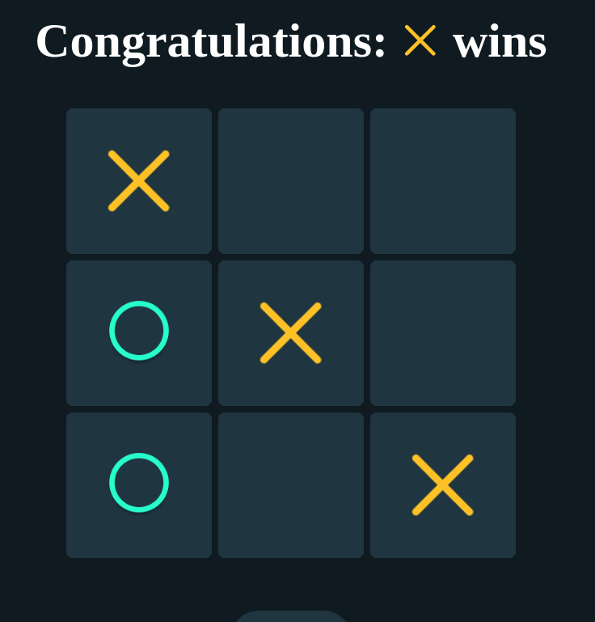

# Tic-Tac-Toe Game in React
Welcome to the Tic-Tac-Toe game, a classic two-player game built using React. This README provides an overview of the game and how to play it.

## How to Play
Tic-Tac-Toe is a two-player game played on a 3x3 grid. One player uses "X" and the other uses "O."

Players take turns marking an empty cell in the grid with their symbol.

The first player to get three of their symbols in a row (horizontally, vertically, or diagonally) wins the game.

If all cells are filled, and there is no winner, the game ends in a draw.

## Game Features
Players can take turns by clicking on the empty cells on the game board.

The game keeps track of the current player, and it displays a message indicating which player's turn it is.

When a player wins, the game displays a "Congratulations" message along with the winning player's symbol.

To start a new game, simply click the "Reset" button, which clears the board and allows you to play again.

## Development
This game was built using React, and it demonstrates the use of state management, event handling, and conditional rendering. The game logic is implemented to check for a win or draw after each move.

The code for this game is available in the TicTacToe.js file within the src/Components/TicTacToe directory.

## Customization
You can easily customize the game's appearance and styling by modifying the CSS in the TicTacToe.css and App.css files.

Feel free to change the background colors, fonts, or the appearance of "X" and "O" symbols by replacing the image assets in the Assets directory.

## Enjoy the Game!
Now that you're familiar with the Tic-Tac-Toe game in React, have fun playing with a friend and enjoy this classic game brought to life in a modern web application.

